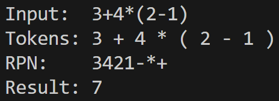

Silly little calculator using the Shunting-Yard algorithm. Written in C++.
This is not a full calculator. It does not implement functions in any capacity, but it could still be educational or useful.

